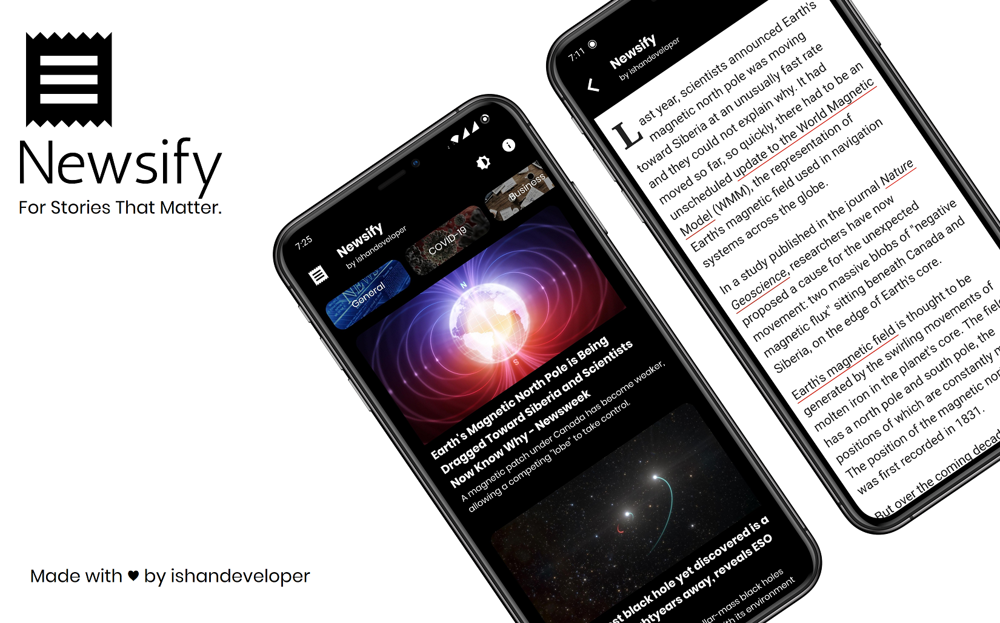
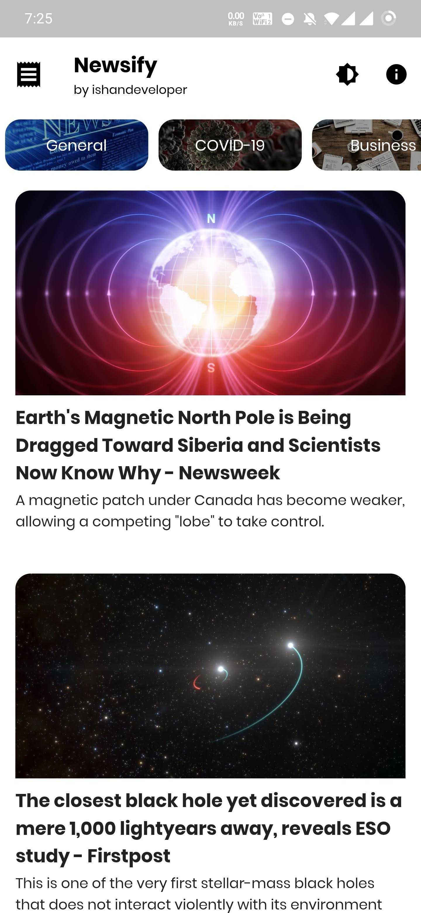

[](http://hits.dwyl.com/ishandeveloper/Newsify-App)




# Newsify App

This is a flutter based <b>modern news app 🗞️</b> which uses NewsAPI to fetch top news headlines from the API. The main aim of this app is to be a leading example of how to build Modern Flutter applications for all Flutter Developers.

The idea is to keep the app super simple while demonstrating new libraries and tools which makes it easier to build high quality Flutter applications.

##### P.S : SUPPORTS BOTH LIGHT AND DARK MODE! 😉
##### Download APK
<pre><a href="https://github.com/ishandeveloper/Newsify-App/raw/master/app.apk">https://github.com/ishandeveloper/Newsify-App/raw/master/app.apk</a></pre>


### Demo

  &nbsp;&nbsp;&nbsp;&nbsp;&nbsp;

###### Light Theme
&nbsp;&nbsp;&nbsp;&nbsp;&nbsp;&nbsp;

###### Dark Theme
  &nbsp;&nbsp;&nbsp;&nbsp;&nbsp;&nbsp;&nbsp;&nbsp;&nbsp;
### Dependencies

1. [Provider](https://pub.dev/packages/provider)

1. [Animated_Text_Kit](https://pub.dev/packages/animated_text_kit)

1. [Cached_network_image](https://pub.dev/packages/cached_network_image)

1. [Webview_Flutter](https://pub.dev/packages/webview_flutter)


## Setup

  ##### Clone the repository
```bash
git clone https://github.com/ishandeveloper/Newsify-App.git
```
  ##### Move to the desired folder
```bash
cd \Newsify-App
```

  ##### To run the app, simply write
```bash
flutter run
```

## Requirements to contribute

- Basic knowledge of programming is mandatory
- The ability to use Git and GitHub
- Some knowledge of Dart and how to use Flutter is preferrable for a head start.
- UI/UX Design skills are appreciable but not mandatory
- Some idea about Firebase or willingness to learn it

### How to make a Pull Request:

**1.** Fork [this](https://github.com/ishandeveloper/Newsify-App) repository.

**2.** Clone the forked repository.

```terminal
git clone https://github.com/<your-github-username>/Newsify-App
```

**3.** Navigate to the project directory.

```terminal
cd Newsify-App
```

**4.** Checkout from master to development branch.

```terminal
git checkout development
```
**5.** Make changes in source code.

**6.** Commit your changes.

```terminal
  git add .
  git commit -m "<your_commit_message>"
```

**7.** Push your local branch to the remote repository.

```terminal
git push -u origin development
```

**8.** Create a Pull Request!

**Congratulations!**  :boom: Sit and relax, you've made your contribution to [Newsify App]  (https://github.com/ishandeveloper/Newsify-App) project.


## Tasks and Features

* Improve the UI
* Implementing the App with Features
* Work on the improvement and building the various pages of the app
* Database integration with  Firebase
* Have a corresponding Web App for this
* Analyze further design requirements and integrate


For help getting started with Flutter, view the online documentation, which offers tutorials, samples, guidance on mobile development, and a full API reference.

##### Made with ♥ by <a href="https://github.com/ishandeveloper">ishandeveloper</a>


[](https://github.com/ishandeveloper)